# Paint

> 🚧 **WIP** - このプロジェクトは開発中です。

[](https://github.com/usapopopooon/paint/releases/tag/v0.0.13) [](https://github.com/usapopopooon/paint/actions/workflows/ci.yml)  [](https://usapopopooon.github.io/paint/) [](https://usapopopooon.github.io/paint/storybook/)

ReactとPixiJSで構築したお絵かきアプリ。


## 機能

- ペン・消しゴムツール（幅調整可能）
- HSVカラーホイール
- Undo/Redo
- ダーク/ライトモード
- 多言語対応（英語/日本語）

## 技術スタック

- **フレームワーク**: React 19, TypeScript
- **描画エンジン**: PixiJS
- **ビルド**: Vite
- **スタイリング**: Tailwind CSS v4
- **UIコンポーネント**: Radix UI, shadcn/ui
- **テスト**: Vitest, Playwright, Storybook
- **CI/CD**: GitHub Actions, GitHub Pages

## アーキテクチャ

**Package by Feature** + **Clean Architecture** を採用しています。

### 設計方針

- **Package by Feature**: 機能単位でコードを整理
- **Clean Architecture**: 各機能内を types / domain / useCases / adapters / infrastructure / helpers / hooks / components のレイヤーで構成
- **1ファイル1関数**: 単一責任原則に従い、テストとの対応を明確化
- **コロケーション**: テスト・ストーリーを各機能内に配置

### Feature 構造（概念図）

```mermaid
flowchart TB
    subgraph feature/foo
        types["types/<br/>型定義"]

        subgraph domain["domain/"]
            entities["entities/<br/>エンティティ・ファクトリ"]
            services["services/<br/>ドメインサービス"]
        end

        useCases["useCases/<br/>アプリケーション操作"]
        adapters["adapters/<br/>外部システム接続"]
        infrastructure["infrastructure/<br/>具体的実装"]
        helpers["helpers/<br/>純粋関数"]
        hooks["hooks/<br/>状態管理"]
        components["components/<br/>UI"]

        types --> domain
        domain --> useCases
        domain --> adapters
        domain --> infrastructure
        useCases --> hooks
        adapters --> hooks
        infrastructure --> hooks
        helpers -.-> hooks
        hooks --> components
    end

    entrypoint["index.ts<br/>公開API"]

    feature/foo --> entrypoint
```



### ディレクトリ構造

```
src/
├── components/ui/       # 共有UIコンポーネント（Button, Slider, Tooltip等）
├── features/            # 機能モジュール
│   └── [feature]/       # 各機能（詳細は機能一覧を参照）
│       ├── types/           # 型定義のみ
│       ├── domain/          # ドメインロジック
│       │   ├── entities/    # エンティティ + ファクトリ（1ファイル1関数）
│       │   └── services/    # ドメインサービス
│       ├── useCases/        # ユースケース（1ファイル1関数）
│       ├── adapters/        # 外部アダプター（Canvas API等）
│       ├── infrastructure/  # 外部システム統合（JSON, API等）
│       ├── helpers/         # 純粋ユーティリティ
│       ├── hooks/           # React hooks
│       ├── components/      # UIコンポーネント
│       └── index.ts         # 公開API
├── hooks/               # グローバルフック（useKeyboardShortcuts）
├── lib/                 # 共有ユーティリティ（色変換、ストレージ等）
└── test/                # テストユーティリティ・モック
```

### 機能一覧

| 機能         | 説明                                |
| ------------ | ----------------------------------- |
| **brush**    | ブラシ設定（BrushTip, StrokeStyle） |
| **canvas**   | キャンバス描画・履歴管理            |
| **color**    | HSVカラーホイール                   |
| **drawable** | 描画要素（Stroke等）とレンダラー    |
| **history**  | Undo/Redo履歴管理                   |
| **i18n**     | 多言語対応（英語/日本語）           |
| **layer**    | レイヤー管理                        |
| **pointer**  | ポインター入力・カーソル表示        |
| **theme**    | ダーク/ライトモード                 |
| **toolbar**  | ツールバーUI                        |
| **tools**    | ペン・消しゴムツール                |

## 開発

```bash
# 依存関係のインストール
npm install

# 開発サーバー起動
npm run dev

# Storybook起動
npm run storybook

# テスト実行
npm test

# ユニットテスト実行
npm run test:unit

# カバレッジ付きテスト
npm run test:coverage

# リント
npm run lint

# ビルド
npm run build
```
