# Paint（仮名）

> 🚧 **WIP** - このプロジェクトは開発中です。

[English](../README.md)

[](https://github.com/usapopopooon/paint/releases/tag/v0.2.1) [](https://github.com/usapopopooon/paint/actions/workflows/ci.yml)  [](https://usapopopooon.github.io/paint/) [](https://usapopopooon.github.io/paint/storybook/)

ReactとCanvas 2Dで構築したお絵かきアプリ 👉 [実際に触ってみる](https://usapopopooon.github.io/paint/)


## 技術スタック

- **フレームワーク**: React 19, TypeScript
- **描画エンジン**: Canvas 2D（PixiJSも代替として使用可能）
- **ビルド**: Vite
- **スタイリング**: Tailwind CSS v4
- **UIコンポーネント**: Radix UI, shadcn/ui
- **テスト**: Vitest, Playwright, Storybook
- **CI/CD**: GitHub Actions, GitHub Pages

## アーキテクチャ

**Package by Feature** + **Clean Architecture** を採用しています。

### 設計方針

- **Package by Feature**: 機能単位でコードを整理
- **Clean Architecture**: 各機能内を types / domain / useCases / adapters / infrastructure / helpers / hooks / components のレイヤーで構成
- **1ファイル1関数**: 単一責任原則に従い、テストとの対応を明確化
- **コロケーション**: テスト・ストーリーを各機能内に配置

### Feature 構造（概念図）



### ディレクトリ構造

```
src/
├── components/ui/       # 共有UIコンポーネント（Button, Slider, Tooltip等）
├── constants/           # グローバル定数（ズーム制限、キャンバスデフォルト等）
├── features/            # 機能モジュール
│   └── [feature]/       # 各機能（詳細は機能一覧を参照）
│       ├── types/           # 型定義のみ
│       ├── constants/       # 定数
│       ├── domain/          # ドメインロジック
│       │   ├── entities/    # エンティティ + ファクトリ（1ファイル1関数）
│       │   └── services/    # ドメインサービス
│       ├── useCases/        # ユースケース（1ファイル1関数）
│       ├── adapters/        # 外部アダプター（Canvas API等）
│       ├── infrastructure/  # 外部システム統合（JSON, API等）
│       ├── helpers/         # 純粋ユーティリティ
│       ├── hooks/           # React hooks
│       ├── components/      # UIコンポーネント
│       └── index.ts         # 公開API
├── hooks/               # グローバルフック（useKeyboardShortcuts）
├── lib/                 # 共有ユーティリティ（色変換、ストレージ等）
├── utils/               # 汎用ユーティリティ関数（toDisplayValue等）
└── test/                # テストユーティリティ・モック
```

## 開発

```bash
# 依存関係のインストール
npm install

# 開発サーバー起動
npm run dev

# Storybook起動
npm run storybook

# テスト実行
npm test

# ユニットテスト実行
npm run test:unit

# カバレッジ付きテスト
npm run test:coverage

# リント
npm run lint

# ビルド
npm run build
```
